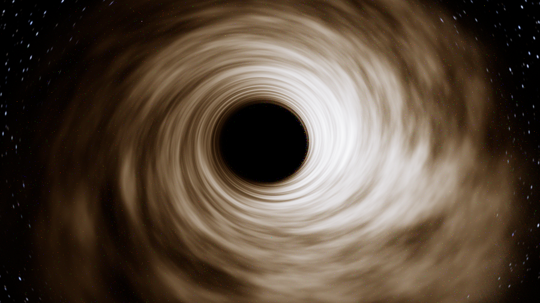
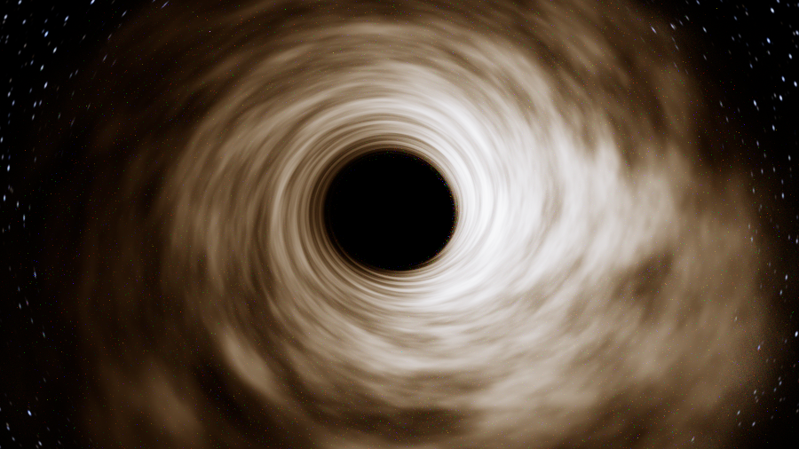
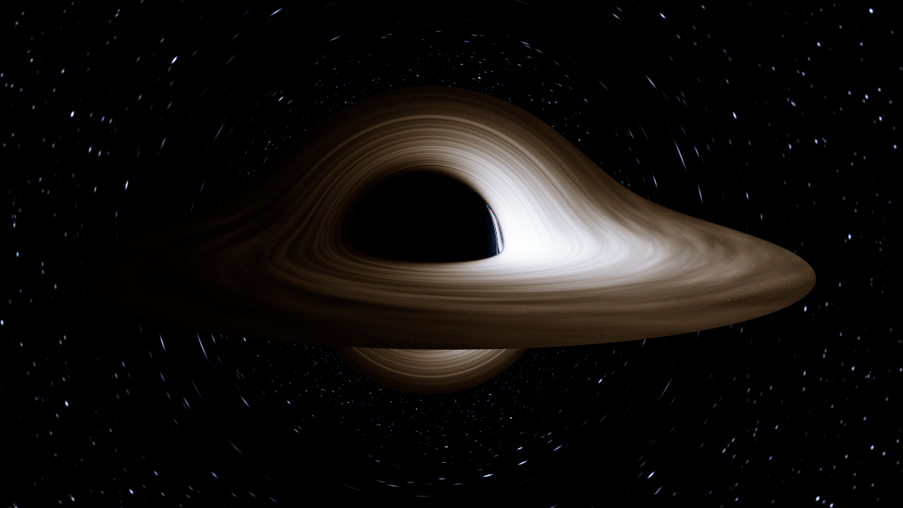
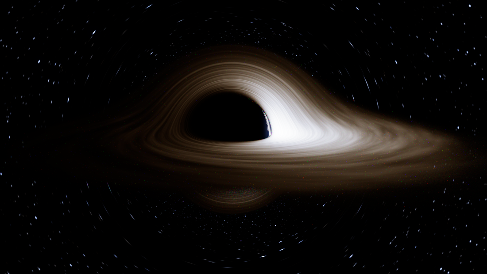

# kerr — a spectral path tracer for a spinning black hole

A Monte Carlo path tracer whose rays are null geodesics of the **Kerr** metric,
rendering a relativistic **Novikov–Thorne** accretion disk. C++20, no
dependencies, multithreaded.

Gravitational lensing, frame dragging, gravitational redshift, orbital Doppler
beaming, the photon ring and the flattened Kerr shadow are not drawn as effects.
They all fall out of integrating the geodesics and carrying one invariant along
them.


The same engine with the disk removed — pure gravitational lensing of the star
field. Stars smear into Einstein arcs, and the dense ring hugging the shadow is
the photon ring, where rays wind around the hole many times and each pixel
samples a wide swathe of sky:


---

## The models at a glance

The renderer is a stack of physical models, each with its own assumptions and
its own validity limits. This table is the map; each row is detailed in
[The models](#the-models) below.

| # | Layer | Model | Central assumption | Knobs |
|---|---|---|---|---|
| 1 | Spacetime | **Kerr** in Boyer–Lindquist coordinates | Stationary, axisymmetric, vacuum, uncharged. The disk's own mass does not gravitate. | `--spin` |
| 2 | Light transport | **Null geodesics**, Hamiltonian form in Mino time | Geometric optics. No dispersion, no plasma refraction, no wave effects. | `--rtol`, `--max-steps` |
| 3 | Disk structure | **Novikov–Thorne**, Page & Thorne (1974) flux | Geometrically thin, steady, locally radiating what it dissipates, zero torque at the ISCO. | `--rin`, `--rout`, `--tpeak` |
| 4 | Disk kinematics | **Prograde Keplerian circular orbits** | Negligible radial drift; no pressure support. Breaks down inside the ISCO. | — |
| 5 | Emission | **LTE blackbody**, transfer on the invariant $I_\lambda\lambda^5$ | Local thermodynamic equilibrium; no spectral lines, no Comptonisation. | `--tpeak` |
| 6 | Outer edge | **Optical-depth taper**, isothermal-slab transfer | Surface density fades; disk stays an infinitely thin sheet. | `--edge`, `--tau` |
| 7 | Disk surface | **Grey Lambertian** scattering | Wavelength-independent albedo, isotropic re-emission. | `--albedo`, `--bounces` |
| 8 | Observer | **ZAMO** orthonormal tetrad | Locally non-rotating camera; pinhole projection. | `--dist`, `--inc`, `--fov` |
| 9 | Background | **Procedural blackbody star field** | Hash-generated, not a real catalogue. | `--sky-gain`, `--star-density`, `--band` |
| 10 | Colour | **CIE 1931** matching functions, sRGB, ACES | Standard observer; display-referred tone curve. | `--exposure`, `--key`, `--bloom` |

Everything above is physical except two clearly-marked knobs: `--turbulence`
(cosmetic mottling, set `0` for the pure Novikov–Thorne profile) and `--edge`
(the taper *form* is right, the width is free — see §6).

---

## Build and run

```powershell
.\build.ps1              # fetches Zig + SDL2 into .toolchain on first run
.\kerr.exe --check       # validate the geodesic engine against closed-form Kerr
.\kerr.exe --preview     # 480x270, a couple of seconds
.\kerr.exe               # 1280x720, 128 spp
.\kerrview.exe           # interactive viewer
```

`build.ps1 cli` or `build.ps1 viewer` builds just one target. Both front ends
share one tracer: `src/render.hpp` holds the physics, and `main.cpp` and
`viewer.cpp` only decide which rays to ask for.

Any recent Clang or GCC works instead:

```sh
clang++ -std=c++20 -O3 -march=native src/main.cpp -o kerr
g++     -std=c++20 -O3 -march=native src/main.cpp -o kerr
```

Do **not** add `-ffast-math`: the integrator uses `isfinite()` to reject bad
trial steps, and `-ffinite-math-only` compiles those checks away.

If Windows reports *"an application control policy has blocked this file"*,
Smart App Control is in enforcement mode and is refusing to run a freshly
written unsigned binary. `build.ps1` works around it by linking to a scratch
name and copying into place; if you compile by hand and hit it, copy the output
to a new filename and run that.

---

## The interactive viewer

`kerrview.exe` drives the same path tracer in real time. Orbit with the left
mouse button, pan with the right, dolly with the wheel, and the image keeps
refining for as long as you leave it alone.

```
left drag     orbit (inclination and azimuth)      [ / ]   spin a/M
right drag    pan the aim point                    , / .   disk outer radius
wheel         dolly in/out                         - / =   exposure
space         play / pause disk rotation           k / l   time scale
t             reset time to zero
ctrl+wheel    field of view                        b       scattering bounces
r             reset camera                         s       save a PNG
                                                   esc/q   quit
```

### Why it has two regimes

One number forces the whole design. Even at 12 Mrays/s a 33 ms frame buys about
**400k samples**, while a 1280×720 window has **921k pixels**. Full resolution
still cannot deliver one sample per pixel inside an interactive frame, so the
viewer switches between:

| | resolution | samples | what you see |
|---|---|---|---|
| **moving** | reduced, chosen from measured throughput | 1 spp, no accumulation | coarse but complete, every frame |
| **settled** | full | accumulating forever | converges while you watch |

The render scale is not a guess. It is the smallest $s$ for which one sample per
pixel still fits the frame budget:

$$
s = \left\lceil \sqrt{\frac{W H \mkern3mu f_{\rm target}}{R}} \right\rceil,
\qquad R = \text{measured samples per second}
$$

with $R$ tracked as a moving average, so the viewer adapts to spin, disk size and
bounce count rather than assuming a fixed cost. Measured on the 16-core machine
at 1280×720, target 30 fps:

```
  moving    scale 1/2   render 640x360    ui 60 fps   first-pass 45 Hz
  settled   scale 1/1   render 1280x720   ui 60 fps   6 -> 46 spp in 3 s
```

The first-pass rate lands above the 30 Hz target because $s$ is a ceiling, which
guarantees the target rather than averaging it.

Those figures are with packet tracing, and the adaptive scale picked the
speedup up on its own: the same formula that chose 1/4 resolution against the
scalar backend now chooses **1/2 — four times the pixels at the same frame
rate** — while settled convergence went from 10 spp to 46 spp in three seconds.
Nothing in the viewer was retuned for it.

### Exposure

Auto-exposure in a progressive renderer is harder than in a batch one, because
the thing being metered is half-drawn. Three rules, each earned by a bug:

**Meter before the reset, not after.** A camera change clears the accumulator.
Metering after that reads an empty buffer — and the original code skipped
uncovered pixels, so it computed a percentile from the handful that happened to
be drawn. Measured while orbiting, coverage was **0.0%** and the anchor came out
five orders of magnitude too small. Metering at the top of the frame, on what
the workers produced since the last reset, gives **100%** coverage instead.

**Meter in log space.** Exposure is a ratio and spans decades, so a linear
`x += (target - x) * 0.25` lets one bad reading throw it somewhere absurd and
then crawl back over dozens of frames. It reached **3×10¹⁵**, which is precisely
what made the first pass after a move arrive white. In log space a bad reading
cannot do that, and the smoothing is perceptually even besides.

**Meter something complete.** Readings from under 25% coverage are discarded in
favour of the last good one — a stale exposure beats a wrong one — and tiles are
now visited in a *shuffled* order rather than raster order, so a partial pass
covers the frame uniformly instead of filling from the top. That makes a partial
frame safe to meter, and as a free side effect the image refines evenly rather
than wiping downward.

Finally, one coarse 96×54 pass runs synchronously at startup, before the window
is shown, so frame one is already correctly exposed rather than arriving blown
out and settling. It costs about 30 ms once.

Together these hold the exposure to ±5% while orbiting, and it tracks scene
brightness over a 100× range: `--tpeak 4000` meters to 2.05, `--tpeak 20000` to
0.018.

### Concurrency

Workers never stop. They take items from one monotonic counter, `tile = w mod N`
and `sample = w / N`, and cycle through tiles indefinitely — so "one more pass"
needs no coordination.

Two things make that safe:

- **A pause barrier.** To change camera or resolution the main thread sets
  `paused`, waits for the active-worker count to reach zero, mutates, then
  releases. Because no worker can be mid-tile at that moment, a stale sample can
  never land in a fresh buffer, and no per-tile generation tracking is needed.
- **A per-tile claim.** Items $w$ and $w+N$ name the *same tile*, so a worker
  that falls a full pass behind could otherwise race another on the same pixels.
  Claiming the tile makes that impossible; a worker finding one taken simply
  drops the item, which costs that tile one sample index.

Two smaller decisions that mattered more than expected:

- The display buffer is **never cleared** on a camera change — only the
  accumulator is. New tiles overwrite the old image in place, so a move reads as
  a refinement rather than a flash of black.
- Workers are spawned on `hardware_concurrency() - 1` threads. Saturating every
  core starved the event loop and held the UI at **24 fps**; giving one logical
  core back put it at a steady **60 fps** for about 8% of sample rate.

Tile size is also chosen per resolution rather than fixed: at 1/8 scale a fixed
64-pixel tile would produce fewer tiles than threads and leave most of the
machine idle.

### Differences from the batch renderer

The physics is identical — the same `tracePath`, the same validated integrator.
The viewer omits bloom (a whole-image post pass, not tile-local) and tone maps
each pixel as its tile is traced, using an exposure that is sampled sparsely and
smoothed over time so the picture does not pulse as samples arrive. For a final
image, use `kerr.exe`.

---

## Why C++

The workload is $\sim 10^8$ independent ray integrations of a small, mildly
stiff ODE system — scalar floating point with unpredictable branching and no
large working set. That wants a language with no runtime overhead between the
arithmetic and the hardware, real 64-bit floats, and cheap threads. C++ (or C,
or Rust) is the right tier; this is C++20 with `std::thread` and no dependencies.

A GPU would in principle go faster, but only with real double-precision
throughput behind it: geodesic integration near the photon ring genuinely needs
64-bit floats, and consumer parts typically run FP64 at a small fraction of
their FP32 rate.

Speed comes from three places, in order of size: putting eight rays in SIMD
lanes, threads, and cutting work. See [Performance](#performance).

---

## The models

Geometrised units throughout: $G = c = M = 1$, so radii are in gravitational
radii $GM/c^2$ and the spin $a_\star = a/M$ is dimensionless in $(-1, 1)$.

### 1. Spacetime — the Kerr metric

The exterior of an uncharged rotating black hole, in Boyer–Lindquist
coordinates:

$$
ds^2 = -\left(1 - \frac{2Mr}{\Sigma}\right)dt^2
-\frac{4Mar\sin^2\theta}{\Sigma}\mkern3mu dt\mkern3mu d\phi
+\frac{\Sigma}{\Delta}\mkern3mu dr^2
+\Sigma\mkern3mu d\theta^2
+\frac{A\sin^2\theta}{\Sigma}\mkern3mu d\phi^2
$$

with

$$
\Sigma = r^2 + a^2\cos^2\theta, \qquad
\Delta = r^2 - 2Mr + a^2, \qquad
A = (r^2+a^2)^2 - a^2\Delta\sin^2\theta .
$$

The event horizon is the outer root of $\Delta = 0$,

$$r_+ = M + \sqrt{M^2 - a^2},$$

and two radii govern the picture. The equatorial circular photon orbit,

$$r_{\rm ph} = 2M\left\lbrace 1 + \cos\left[\tfrac{2}{3}\arccos(\mp a_\star)\right]\right\rbrace,$$

sets the photon ring and the shadow edge, while the innermost stable circular
orbit sets where the disk must end:

$$r_{\rm isco} = M\left[3 + Z_2 \mp \sqrt{(3-Z_1)(3+Z_1+2Z_2)}\right],$$

$$
Z_1 = 1 + \left(1-a_\star^2\right)^{1/3}\left[(1+a_\star)^{1/3} + (1-a_\star)^{1/3}\right],
\qquad Z_2 = \sqrt{3a_\star^2 + Z_1^2}.
$$

The upper sign is prograde. Both are validated in `--check`.

**Assumes:** vacuum, so the disk's own mass and the star field do not gravitate.
For any realistic disk mass that is an excellent approximation.

### 2. Light transport — null geodesics in Mino time

Kerr is stationary and axisymmetric, so $E = -p_t$ and $L = p_\phi$ are
conserved and never integrated. Rather than evaluate Christoffel symbols, the
code uses the Hamiltonian $\mathcal{H} = \tfrac12 g^{\mu\nu}p_\mu p_\nu$ and the
rescaled quantity

$$
F \equiv \Sigma\mkern3mu  g^{\mu\nu}p_\mu p_\nu
= \Delta p_r^2 + p_\theta^2
+\frac{\left(L - aE\sin^2\theta\right)^2}{\sin^2\theta}
-\frac{\left[E(r^2+a^2) - aL\right]^2}{\Delta},
$$

which vanishes identically on a null geodesic. Integrating in **Mino time**,
$d\tau = d\lambda/\Sigma$, makes $F/2$ the Hamiltonian and cancels $\Sigma$ out
of the $r$ and $\theta$ equations entirely. Writing $P = E(r^2+a^2) - aL$:

$$
\frac{dr}{d\tau} = \Delta\mkern3mu  p_r, \qquad
\frac{d\theta}{d\tau} = p_\theta, \qquad
\frac{d\phi}{d\tau} = \frac{L}{\sin^2\theta} - aE + \frac{aP}{\Delta},
$$

$$
\frac{dp_r}{d\tau} = -\frac{1}{2}\frac{\partial F}{\partial r}
= -\frac{1}{2}\left[\Delta' p_r^2 - \frac{4rEP}{\Delta} + \frac{P^2\Delta'}{\Delta^2}\right],
\qquad
\frac{dp_\theta}{d\tau} = \cos\theta\left(\frac{L^2}{\sin^3\theta} - a^2E^2\sin\theta\right).
$$

Five ODEs, no $r$–$\theta$ coupling, one `sincos` and two divisions per
evaluation. That decoupling is the single biggest reason this is fast.

Integration is **Dormand–Prince 5(4)**, adaptive, with the standard 5th-order
dense output. The interpolant earns its keep: it locates the equatorial-plane
crossing to $\sim 10^{-12}$ of a step without one extra force evaluation.

A ray falling inside $r_{\rm ph}$ while moving inward can never turn around, so
that is an exact capture test — and it avoids integrating into the stiff region
where $\Delta \to 0$.

Because $F$ never advances the solution, its drift is a free error estimate;
`--check` reports it.

**Assumes:** geometric optics. No plasma dispersion, no wave effects, no
polarisation transport.

### 3. Disk structure — Novikov–Thorne

A geometrically thin, optically thick disk in the equatorial plane, radiating
locally what it dissipates. With $x = \sqrt{r/M}$, $x_0 = \sqrt{r_{\rm isco}/M}$,
and $x_1, x_2, x_3$ the roots of $x^3 - 3x + 2a_\star = 0$,

$$
x_1 = 2\cos\left(\tfrac{1}{3}\arccos a_\star - \tfrac{\pi}{3}\right), \quad
x_2 = 2\cos\left(\tfrac{1}{3}\arccos a_\star + \tfrac{\pi}{3}\right), \quad
x_3 = -2\cos\left(\tfrac{1}{3}\arccos a_\star\right),
$$

the Page & Thorne (1974) flux is

$$
F(r) \propto \frac{1}{x^4\left(x^3 - 3x + 2a_\star\right)}
\left[\mkern3mu  x - x_0 - \frac{3}{2}a_\star\ln\frac{x}{x_0}
-\sum_{i=1}^{3}\frac{3\left(x_i - a_\star\right)^2}{x_i\left(x_i-x_j\right)\left(x_i-x_k\right)}
\ln\frac{x - x_i}{x_0 - x_i}\right]
$$

with $j, k \neq i$. The bracket vanishes at $x = x_0$: that is the **zero-torque
inner boundary**, and it is why the disk fades out on its own at the ISCO rather
than being cut there. Far out the flux falls as $r^{-3}$.

The effective temperature follows from $F = \sigma T^4$:

$$T(r) = \left(F(r)/\sigma\right)^{1/4},$$

normalised so the peak is `--tpeak`. With the defaults that is 9000 K near
$r \approx 3M$ falling to about 3600 K at the outer edge — a factor $\sim 150$ in
visible radiance, which is why the disk runs from white-hot to dull orange along
its length.

**Assumes:** steady state, thin ($H \ll r$), locally radiating its dissipation.
The formula is singular at exactly $a_\star = 0$ (a removable $0/0$); the code
clamps to $10^{-6}$, a relative error of $\sim 10^{-7}$.

### 4. Disk kinematics — Keplerian circular orbits

Matter is on prograde circular geodesics:

$$
\Omega = \frac{M^{1/2}}{r^{3/2} + aM^{1/2}}, \qquad
u^t = \frac{r^{3/2} + aM^{1/2}}{\sqrt{r^3 - 3Mr^2 + 2aM^{1/2}r^{3/2}}},
\qquad u^\phi = \Omega\mkern3mu  u^t .
$$

This is what produces the beaming asymmetry: near the ISCO the orbital speed is
a large fraction of $c$, so one side of the disk approaches at relativistic
speed and the other recedes.

**Assumes:** no radial drift and no pressure support. Valid outside the ISCO;
inside it the flow plunges and this model does not apply, which is exactly where
the disk is truncated.

#### Rotation, and why it needs coordinate time

The disk turns at this Keplerian rate, and the geodesic carries
Boyer–Lindquist coordinate time so that it turns *correctly*.

Start with what is **not** visible. A Novikov–Thorne disk is stationary and
axisymmetric: its temperature depends on $r$ alone, so it looks identical at
every instant, and the Doppler beaming pattern is fixed in place. An
axisymmetric disk rotating is, by construction, invisible. What you see turning
is the non-axisymmetric structure, which here is the `--turbulence` mottling —
so with `--turbulence 0` the disk is *correctly* motionless.

That structure is advected with the gas. A fluid element at azimuth $\phi_0$
sits at $\phi = \phi_0 + \Omega(r)\mkern3mu t$, so the pattern is sampled at
$\phi - \Omega(r)\mkern3mu t$, using the same $\Omega$ that already sets the
Doppler shift. Because $\Omega$ falls off with radius the disk shears: at
$a = 0.94$ the ISCO orbit takes about **24 M** while $r = 16M$ takes **420 M**,
so the inner disk laps the outer some seventeen times. That differential
winding is the visible effect.

| $t = 0$ | $t = 16M$, two thirds of an ISCO orbit |
|---|---|
|  |  |

**Coordinate time is the part that takes real work.** Light from the far side of
the disk, and from the lensed images that loop around the hole, left *earlier*
than light from the near side — by tens of $M$, against a 24 $M$ inner orbital
period. Without tracking it every part of the image would show the disk at one
instant, which is simply wrong. So the integrator carries $t$ as a sixth state
component, from the same Hamiltonian differentiated by energy:

$$
\frac{dt}{d\tau} = -\frac{1}{2}\frac{\partial F}{\partial E}
= a\left(L - aE\sin^2\theta\right) + \left(r^2 + a^2\right)\frac{P}{\Delta}
$$

and a disk hit is dated $t_{\rm obs} - \Delta t$. It costs about 5% (60 → 83
integration steps per ray, since $t$ now participates in the error norm).

That equation is checked against a closed form in `--check`: for a radial ray in
Schwarzschild $dt/dr = (1 - 2M/r)^{-1}$ integrates to
$\Delta t = (r_2 - r_1) + 2M\ln\frac{r_2 - 2M}{r_1 - 2M}$, the excess over
$r_2 - r_1$ being the Shapiro delay. It matches to **1.3e-15**. A second test
pins the *rate*: a ring must return to exactly its starting state after one
period $2\pi/\Omega(r)$ — it closes to **6e-16** — and must differ half a period
in, which it does.

**On "the right speed" in wall-clock terms.** There isn't one: it depends
entirely on the mass. $24M$ at the ISCO is 1.2 ms for a 10 $M_\odot$ hole, about
8 minutes for Sgr A\*, and roughly 9 days for M87\*. What physics fixes is the
*ratio* of rates between radii, which is what the code gets right; the absolute
rate is a playback choice. `--timescale` in the viewer sets how much coordinate
time passes per second of wall clock, defaulting to 6 M/s so one inner orbit
takes about four seconds. `--time T` renders a single instant, so a sequence is
just a loop:

```powershell
0..119 | % { .\kerr.exe --quiet --time ($_ * 0.4) --out ("frame{0:d3}.png" -f $_) }
```

### 5. Emission and relativistic transfer

Each camera sample carries a **single wavelength** — the renderer is spectral,
not RGB. Emission is a blackbody at the local temperature,

$$B_\lambda(\lambda, T) = \frac{2hc^2}{\lambda^5}\mkern3mu \frac{1}{e^{hc/\lambda k_B T} - 1},$$

and transfer rides on the Lorentz invariant $I_\lambda \lambda^5$. Defining the
shift factor between the camera and a local emitter with four-velocity $u^\mu$,

$$g = \frac{\nu_{\rm cam}}{\nu_{\rm local}}, \qquad \nu_{\rm local} = -p_\mu u^\mu,$$

the observed radiance at camera wavelength $\lambda_0$ is

$$I_\lambda^{\rm obs}(\lambda_0) = g^5\mkern3mu  B_\lambda\mkern-3mu \left(g\lambda_0,\mkern5mu  T\right).$$

For the Keplerian disk this evaluates to $\nu_{\rm local} = u^t\left(E - \Omega L\right)$,
and for the star field at infinity to $\nu_\infty = E$. A single running
variable carries $g$ along the whole path.

This is why the colours are trustworthy rather than tinted: gravitational
redshift, frame dragging and Doppler beaming all enter through one factor, and
because energy genuinely moves between wavelengths, the approaching side goes
blue with the correct hue.

**Assumes:** local thermodynamic equilibrium. No spectral lines, no
Comptonisation, no limb darkening.

### 6. The outer edge — an optical-depth taper

A real thin disk has no outer edge: the dissipation falls as $r^{-3}$ and the
disk continues to wherever it is fed. A hard stop at `--rout` has no physics
behind it, and it looks like it — a knife-edge rim.

What ends a disk observationally is its surface density dropping until it is no
longer optically thick, so the meaningful quantity is optical depth, not a
radius:

$$\tau_\perp(r) = \min\left(\tau_{\max},\mkern5mu  \exp\frac{r_{\rm out} - r}{w}\right).$$

`--rout` is then the photosphere edge ($\tau_\perp = 1$) rather than a wall, and
`--edge` is the e-folding width $w$. Transfer through the layer is the
isothermal-slab solution

$$I_{\rm out} = I_{\rm in}\mkern3mu e^{-\tau} + B_\lambda(T)\left(1 - e^{-\tau}\right),$$

sampled by passing the photon through untouched with probability $e^{-\tau}$ and
otherwise letting the layer emit. Two things then happen together, as they must:
the rim **dims**, because a thin layer cannot radiate $\sigma T^4$, and it
becomes **transparent**, so stars and the disk's own far side show through it.
As $\tau \to \infty$ this collapses exactly to the opaque disk, and `--edge 0`
recovers the hard edge.

| `--edge 0` — hard cut | default `--edge 1.2` — optical-depth taper |
|---|---|
|  |  |

Left, the disk ends on a crisp boundary — nothing in the physics puts an edge
there. Right, the rim dims and thins out, and the star field shows through it.
Both were rendered with identical settings apart from `--edge`.

A ray crossing at a grazing angle passes through more material:

$$
\tau_{\rm eff} = \frac{\tau_\perp}{\lvert\mu\rvert}, \qquad
\mu = \frac{p_\mu e_{\hat\theta}^{\mkern3mu \mu}}{\nu_{\rm local}} = \frac{p_\theta}{r\mkern3mu \nu_{\rm local}},
$$

since $e_{\hat\theta}$ is exactly $\partial_\theta$ normalised in the equatorial
plane. The rim therefore stays opaque where you skim it — real limb behaviour,
at no cost.

The soft edge is in fact slightly *faster* (60 vs 64 integration steps per ray),
because rays terminate on the extended disk instead of integrating out to the
escape radius.

The **inner** edge is deliberately left sharp: that one is the ISCO, where the
zero-torque boundary already drives emissivity to zero on its own.

`--tau` caps the interior optical depth at 30 rather than the $10^4$–$10^6$ a
real disk carries. Since $e^{-30} \approx 10^{-13}$ is already perfectly opaque
to within floating-point noise, the cap is numerically indistinguishable from
the true value while keeping the taper width interpretable.

**Assumes:** the taper *form* is physical; its width $w$ is a free parameter,
where a real disk's surface density follows from accretion rate and viscosity.

### 7. Disk surface — grey Lambertian scattering

On a hit the tracer can re-emit into the hemisphere the light came from, using a
fluid-frame tetrad built by Gram–Schmidt on the orbital four-velocity, and
continue the geodesic. Survival is decided by Russian roulette on the albedo, so
survivors carry unit weight.

That reproduces **returning radiation** — light that leaves the disk, is bent
right around the hole, and lands back on it. With `--albedo 0.9 --bounces 3` it
raises peak disk brightness by $\sim 19$% over the single-bounce result.

**Assumes:** a wavelength-independent albedo and isotropic re-emission, not a
real electron-scattering atmosphere.

### 8. Observer — the ZAMO camera

The camera is a **zero-angular-momentum observer**, which stays well defined
inside the ergosphere where static observers cannot exist. With

$$\omega = \frac{2Mar}{A}, \qquad \alpha = \sqrt{\frac{\Sigma\Delta}{A}},$$

a photon of unit locally-measured energy travelling along the frame direction
$\hat{n} = (n_{\hat r}, n_{\hat\theta}, n_{\hat\phi})$ has

$$
L = n_{\hat\phi}\sin\theta\sqrt{A/\Sigma}, \quad
E = \alpha + \omega L, \quad
p_r = n_{\hat r}\sqrt{\Sigma/\Delta}, \quad
p_\theta = n_{\hat\theta}\sqrt{\Sigma}.
$$

Rays are built in this tetrad, so `--fov` is a genuine local angle.

### 9. Background — procedural star field

Stars are generated on demand from an integer hash over cube-face cells: no
memory, identical across threads, and each is a blackbody, so it redshifts
through the lens like everything else. Angular size tracks pixel size, keeping
points antialiased at any resolution.

One deliberate approximation: rays that have already scattered off the disk see
only the smooth galactic band, not the point stars. Stars are very nearly delta
functions, so sampling them through a diffuse bounce throws off severe
fireflies — and the quantity is negligible anyway, since a 9000 K annulus
outshines the starlight it reflects by roughly ten orders of magnitude.

### 10. Colour — CIE 1931 and ACES

Spectral radiance is integrated against the CIE 1931 standard observer,

$$
X = \int \bar{x}(\lambda)\mkern3mu I_\lambda\mkern3mu d\lambda, \qquad
Y = \int \bar{y}(\lambda)\mkern3mu I_\lambda\mkern3mu d\lambda, \qquad
Z = \int \bar{z}(\lambda)\mkern3mu I_\lambda\mkern3mu d\lambda,
$$

using the multi-lobe Gaussian fit of Wyman, Sloan & Shirley (2013), then
converted to linear sRGB and through a fitted ACES filmic curve. Wavelength is
stratified across the sample sequence, so spectral noise is negligible even at
modest sample counts.

---

## Validation

`--check` tests the engine against closed-form Kerr results rather than against
its own output:

```
  ISCO   a=0     (prograde)                         6.000000000  relerr 0.00e+00
  ISCO   a=0.9   (prograde)                         2.320883042  relerr 5.33e-10
  ISCO   a=0.9   (retrograde)                       8.717352280  relerr 6.96e-11
  photon a=0     (prograde)                         3.000000000  relerr 0.00e+00
  photon orbit defining-equation residual             4.441e-16
  b_crit a=0                  (3 sqrt 3)            5.196152423  relerr 6.42e-11
  b_crit a=0.9   (prograde)                         2.844421405  relerr 7.03e-10
  b_crit a=0.9   (retrograde)                      -6.832319233  relerr 3.03e-10
  b_crit a=0.998 (prograde)                         2.110887795  relerr 2.25e-10
  deflection vs post-Newtonian series (rel)           8.503e-05
  null constraint drift, 400 rays (relative)          8.556e-08
  disk u^t at r=1000 (weak field)                   1.001503298  relerr 8.52e-08
  disk inner edge == ISCO                           2.320883042  relerr 0.00e+00
  Page-Thorne flux vanishes at the ISCO                                      ok
```

The two strongest are end-to-end.

**Critical impact parameter.** Rays are shot from $r = 1000M$ and bisected on the
capture boundary. That boundary is a separatrix, so it is exquisitely sensitive
to integration error, and it has a closed form at $r = r_{\rm ph}$:

$$b_{\rm crit} = -\mkern3mu \frac{r_{\rm ph}^3 - 3Mr_{\rm ph}^2 + a^2 r_{\rm ph} + a^2 M}{a\left(r_{\rm ph} - M\right)}.$$

Agreement is $\sim 10^{-10}$, including at $a_\star = 0.998$.

**Light deflection.** Weak-field rays are compared against the post-Newtonian
series

$$
\alpha = \frac{4M}{b} + \frac{15\pi}{4}\left(\frac{M}{b}\right)^{2}
+\frac{128}{3}\left(\frac{M}{b}\right)^{3}
+\mathcal{O}\mkern-3mu \left(\left(\frac{M}{b}\right)^{4}\right),
$$

matching to $8\times10^{-5}$. This exercises the integrator *and* the
asymptotic-direction extraction together.

The null-constraint figure is a relative cancellation residual: $F$ is a
difference of terms of order $E^2r^2$, and at the escape radius double precision
alone costs $\sim 10^{-10}$ of that per evaluation.

---

## Performance

16-core / 32-thread Zen 5 (Ryzen 9 9950X), 640×360 at 32 spp, default settings.

**11.3 Mrays/s**, from 1.03 where this started. The 1920×1080 hero image at
384 spp takes **58 s**, down from 266 s.

### Packet tracing: eight rays per lane

The single largest win, and the one that needed the most machinery. A single
ray's Dormand–Prince stages are strictly sequential — each right-hand side waits
on the previous one's `sincos` and divide — so scalar tracing sits at ~850
cycles per step with the FPU mostly idle. Nothing about *one* ray fixes that.
Eight independent rays in eight lanes do, because their dependency chains are
unrelated.

| | Mrays/s | steps/ray | speedup |
|---|--:|--:|--:|
| scalar | 2.95 | 60 | 1.0× |
| 2 lanes | 4.96 | 66 | 1.7× |
| 4 lanes | 8.04 | 72 | 2.7× |
| **8 lanes** | **11.41** | 78 | **3.9×** |

Per-step throughput went from 179 to 1078 Msteps/s — **6.0×**, against a
theoretical ceiling of 8. The gap is lane divergence: a packet runs until *every*
lane has terminated, so it does `max` steps rather than each ray's own, which is
the 60 → 78 steps/ray column. Eight lanes still wins despite carrying the most
waste, so the extra width more than pays for the divergence.

Coherence is free here. A packet is eight samples of the **same pixel**,
differing only by sub-pixel jitter and wavelength — and wavelength does not enter
the geodesic at all, only the emission — so the eight trajectories stay tightly
together. (The viewer packs eight *adjacent pixels* instead, for the same
reason.)

Two pieces had to be built: an SoA integrator where a lane that rejects a step,
hits the disk or crosses the horizon is handled by a mask instead of a branch;
and a vectorised `sincos`, since there is no vector libm here. Cody–Waite
reduction plus Taylor series gets within **1.1e-15** of libm, verified in
`--check`.

`--no-simd` runs the scalar path, which is kept as the reference.

### What vector width actually buys

The earlier version of this file claimed the code could not use AVX-512. That
was true of *scalar* tracing and is now obsolete — but the follow-up is not what
was predicted:

| build | scalar | 8-wide packet |
|---|--:|--:|
| SSE2 only (`-mno-avx -mno-fma`) | 2.54 | 4.05 |
| AVX2 (`-mno-avx512f`) | 2.93 | 11.33 |
| AVX-512 (`-march=native`) | 2.83 | 11.41 |

Vectorising was worth **2.8×** (SSE2 → AVX2). **AVX-512 specifically adds
~1%**, inside the noise. Eight lanes still beat four, but on AVX2 that is two
256-bit registers in flight rather than one 512-bit one — so the win is having
eight rays in flight, not the wider register. The prediction that this needed
AVX-512 was wrong; it needed *vectorisation*, and 256-bit hardware captures
essentially all of it.

### Threads

| threads | time | Mrays/s |
|--------:|-----:|--------:|
| 1 | 10.8 s | 0.68 |
| 4 | 2.8 s | 2.61 |
| 16 | 0.90 s | 8.21 |
| 31 | 0.65 s | 11.31 |

**16.6× on 16 cores + SMT.** Work is handed out as 16×16 tiles from an atomic
counter, so the expensive pixels — rays that wind near the photon ring — do not
stall a whole row.

### Earlier scalar tuning

Before packet tracing, these took it from 1.03 to ~2.9 Mrays/s:

| change | effect |
|---|---|
| `--rtol` 1e-9 → 1e-6 default | 2.2× faster; max deviation ~1% of peak on 8 of 129600 pixels, mean $3\times10^{-4}$ |
| sign test instead of `cos()` in the crossing search | removed ~50 cosines per disk crossing and 2 per step |
| hoisted per-ray constants, 4 divisions → 2, one `sincos` | ~6% |
| `pow(err,-0.2)` → seeded Newton fifth root | ~5%, image identical to $4\times10^{-9}$ mean |

Every tolerance claim above was checked by diffing HDR buffers, not by eye.

### Is the packet path actually the same tracer?

Two tests, in `--check`:

- **`vsincos` against libm** over the θ range the tracer uses: max absolute
  error **1.1e-15**, and the Cody–Waite reduction holds to the same figure over
  [-200, 200], so it is not merely correct near the fold.
- **Packet against scalar on identical rays.** 4096 camera rays down both paths,
  with Monte Carlo taken out of the picture entirely, comparing where each ray
  ended up: **0 outcome disagreements**, and a maximum relative difference in
  final radius of **8e-12**. The packet tracer is not statistically equivalent
  to the scalar one, it is numerically equivalent.

At the image level, packet and scalar use different random streams, so they are
compared the way the disk-edge change was: their difference is **9× smaller than
the noise floor** measured between two seeds of the same build (3.3% against
29.7% mean), with image means agreeing to 0.16%.

### Where the remaining headroom is

Divergence is now the visible cost: 78 steps per ray against the 60 a scalar
trace needs, because a packet cannot retire until its slowest lane does.
Refilling finished lanes with fresh rays instead of idling them would recover
most of that — worth roughly 1.3× if it were free, less in practice once the
compaction is paid for.

---

## Options

```
Image     --width --height --spp --bounces --threads --seed --out --pfm
Hole/cam  --spin --dist --inc --cam-phi --fov --yaw --pitch
Disk      --rin --rout --tpeak --albedo --turbulence --edge --tau --time
Sky       --sky-gain --star-density --band --nostars
Tone map  --exposure --key --bloom --desat
Accuracy  --rtol --max-steps --no-simd
Other     --preview --check --stats --quiet --help
```

`--stats` prints luminance percentiles and the exposure anchor, the quickest way
to tune a shot. `--pfm` writes the linear HDR buffer alongside the PNG.

Shots that exercise different corners of the models:

```powershell
.\kerr.exe --inc 88 --fov 30 --rout 25          # near edge-on, extreme beaming
.\kerr.exe --inc 25 --fov 45                    # face-on, the disk as a ring
.\kerr.exe --spin 0.0  --tpeak 7000             # Schwarzschild: ISCO 6M, round shadow
.\kerr.exe --spin 0.998 --inc 85                # near-extremal, ISCO ~1.24M
.\kerr.exe --albedo 0.9 --bounces 4             # exaggerated returning radiation
.\kerr.exe --edge 0                             # hard-edged disk, for comparison
.\kerr.exe --edge 3 --rout 14                   # a broad, diffuse outer rim
.\kerr.exe --turbulence 0 --nostars             # clean Novikov-Thorne profile
.\kerr.exe --rout 0.01 --sky-gain 1.0           # pure lensing, no disk
```

---

## What this does not model

- The disk has **zero thickness**. No volumetric emission, no optically thin
  corona, no jet. The outer edge fades through an optical depth rather than
  stopping dead, but it fades as an infinitely thin sheet losing opacity, not as
  a flaring three-dimensional flow — a real disk thickens as $H/r$ grows.
- The outer taper is the **right form for the wrong reason**: real surface
  density is set by accretion rate and viscosity, whereas `--edge` is free. The
  transfer through it is correct; where the disk ends is a knob.
- `--turbulence` is **cosmetic** mottling, not a fluid simulation. Set it to `0`
  for the pure Novikov–Thorne profile.
- Scattering off the disk is a **grey Lambertian** albedo, so returning
  radiation is qualitatively right but not spectrally exact.
- **No polarisation**, which is a real observable for these systems.
- The plunging region inside the ISCO is treated as **transparent** — real flows
  emit there, weakly.
- Novikov–Thorne is a **time-averaged** model; this is a stationary snapshot,
  exact for an axisymmetric steady disk but unable to show variability.
- Stars are procedural, not a real catalogue.

---

## Layout

```
src/core.hpp      vectors, metric container, PCG32, sampling
src/kerr.hpp      Kerr metric, geodesic RHS, Dormand-Prince, tetrads
src/scene.hpp     Novikov-Thorne disk, optical-depth edge, star field
src/spectrum.hpp  Planck, CIE 1931, sRGB, ACES
src/image.hpp     PNG / PPM / PFM writers (no libraries)
src/simd.hpp      8-wide vector types, vectorised sincos and fifth root
src/packet.hpp    SoA Dormand-Prince and packet path tracing
src/render.hpp    scalar propagation and path tracing, camera -- the reference
src/main.cpp      batch renderer: threading, tone mapping, CLI, self-test
src/viewer.cpp    SDL2 viewer: progressive pipeline, camera controls
```

## References

- Bardeen, Press & Teukolsky (1972), *Rotating Black Holes*, ApJ **178**, 347 — ISCO and photon orbits.
- Novikov & Thorne (1973), *Astrophysics of Black Holes* — relativistic thin-disk model.
- Page & Thorne (1974), ApJ **191**, 499 — the dissipation profile used here.
- Mino (1996), Phys. Rev. D **67**, 084027 — the time variable that decouples $r$ and $\theta$.
- Dormand & Prince (1980), *J. Comp. Appl. Math.* **6**, 19 — the embedded 5(4) pair and its dense output.
- Wyman, Sloan & Shirley (2013), *JCGT* **2**(2) — the CIE matching-function fit.
