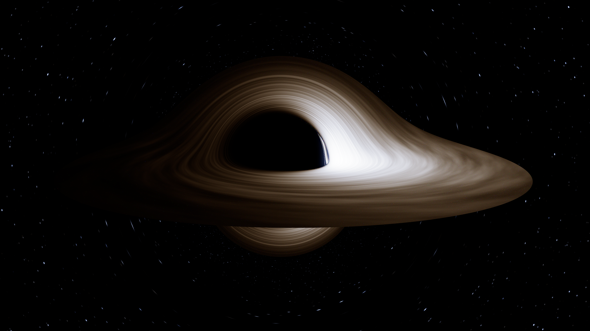
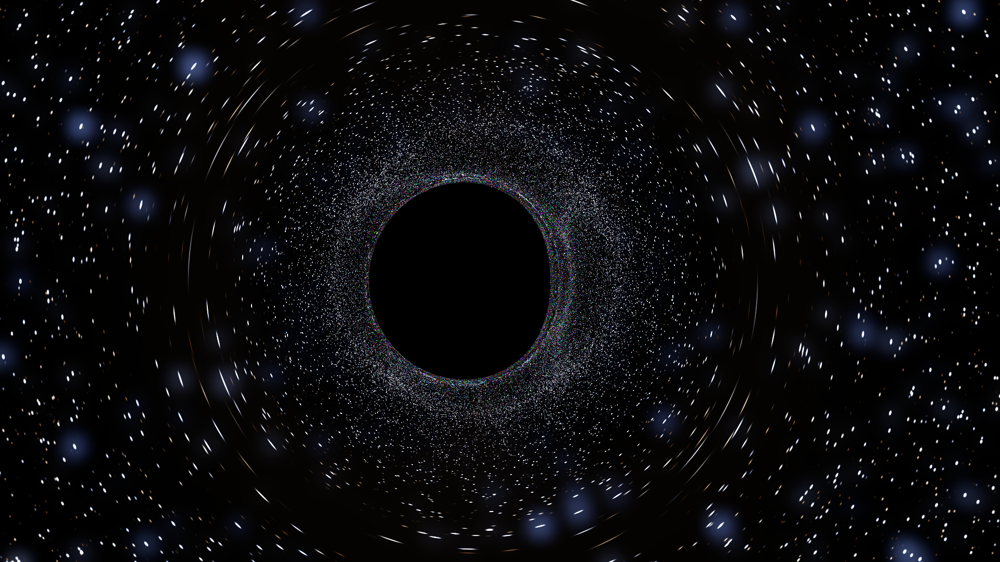

# kerr — a spectral path tracer for a spinning black hole

A Monte Carlo path tracer whose rays are null geodesics of the **Kerr** metric,
rendering a relativistic **Novikov–Thorne** accretion disk. Written in C++20,
no dependencies, multithreaded.

Gravitational lensing, frame dragging, gravitational redshift, orbital Doppler
beaming, the photon ring and the flattened Kerr shadow are not drawn as effects.
They all fall out of integrating the geodesics and carrying one invariant along
them.



Same engine with the disk removed — pure gravitational lensing of the star
field. The stars smear into Einstein arcs, and the dense ring hugging the shadow
is the photon ring, where rays wind around the hole many times and each pixel
samples a wide swathe of sky:



---

## Build and run

```powershell
.\build.ps1              # portable Zig toolchain in .toolchain, no install needed
.\kerr.exe --check       # validate the geodesic engine against closed-form Kerr
.\kerr.exe --preview     # 480x270, a couple of seconds
.\kerr.exe               # 1280x720, 128 spp
```

Any recent Clang or GCC works instead:

```sh
clang++ -std=c++20 -O3 -march=native src/main.cpp -o kerr
g++     -std=c++20 -O3 -march=native src/main.cpp -o kerr
```

Do **not** add `-ffast-math`: the integrator uses `isfinite()` to reject bad
trial steps, and `-ffinite-math-only` compiles those checks away.

If Windows reports *"an application control policy has blocked this file"*,
Smart App Control is in enforcement mode and is refusing to run a freshly
written unsigned binary. `build.ps1` already works around it by linking to a
scratch name and copying into place; if you compile by hand and hit it, copy the
output to a new filename and run that.

---

## Why C++

The workload is ~10⁸ independent ray integrations of a small stiff-ish ODE
system — pure scalar floating point with unpredictable branching and no large
working set. That wants a language with no runtime overhead between the
arithmetic and the hardware, real 64-bit floats, and cheap threads. C++ (or C,
or Rust) is the right tier; this is C++20 with `std::thread` and no
dependencies.

A GPU would in principle go faster still, but only with real double-precision
throughput behind it: geodesic integration near the photon ring genuinely needs
64-bit floats, and consumer parts typically run FP64 at a small fraction of
their FP32 rate. On a many-core CPU with full-width SIMD the CPU is the
straightforward target.

---

## The physics

### Metric and geodesics

Boyer–Lindquist coordinates, geometrised units `G = c = M = 1`, so distances
are in gravitational radii and spin `a` is dimensionless in `(-1, 1)`.

Kerr is stationary and axisymmetric, so `E = -p_t` and `L = p_φ` are conserved
and never need integrating. Rather than evaluate Christoffel symbols, the code
uses the Hamiltonian form with the quantity

```
F = Δ p_r² + p_θ² + (L - a E sin²θ)² / sin²θ - [E(r² + a²) - a L]² / Δ
```

which equals `Σ · gᵘᵛ pᵤ pᵥ` and therefore vanishes identically on a null
geodesic. Integrating in **Mino time** (`dτ = dλ / Σ`) makes `F/2` the
Hamiltonian, and the `Σ` factor cancels out of the `r` and `θ` equations
completely. What remains is five ODEs whose right-hand side is about thirty
flops with one `sincos` and two divisions, with no `r`–`θ` coupling at all:

```
dr/dτ     = Δ p_r
dθ/dτ     = p_θ
dφ/dτ     = L/sin²θ - aE + aP/Δ
dp_r/dτ   = -½ ∂F/∂r
dp_θ/dτ   = -½ ∂F/∂θ
```

Integration is **Dormand–Prince 5(4)**, adaptive, with the standard 5th-order
dense output. The interpolant matters: it locates the equatorial-plane crossing
(the disk) to ~10⁻¹² of a step without a single extra force evaluation.

Rays that fall inside the **prograde circular photon orbit** while moving inward
can never turn around again, which gives an exact capture test and avoids
integrating into the stiff region where `Δ → 0` at the horizon.

`F` is not used to advance the solution, so its drift is a free error estimate
— `--check` reports it.

### The disk

Geometrically thin, optically thick, equatorial, on prograde Keplerian circular
orbits between the ISCO and `--rout`. Each annulus radiates as a blackbody at
the local effective temperature from the **Page & Thorne (1974)** dissipation
profile, which vanishes at the ISCO (zero-torque inner boundary) and falls off
as `r⁻³` far out. `T = (F/σ)^¼`, normalised so the peak is `--tpeak`.

With the defaults that means 9000 K near `r ≈ 3M` falling to about 3600 K at the
outer edge — a factor ~150 in visible radiance, which is why the disk goes from
white-hot to dull orange along its length.

### Radiative transfer

The renderer is **spectral**, not RGB: each camera sample carries one
wavelength. Transfer uses the Lorentz invariant `I_λ λ⁵`, so a source at local
temperature `T` seen with shift factor `g = ν_camera / ν_local` contributes

```
g⁵ · B_λ(g·λ_camera, T)
```

One running variable tracks `g` along the path, and gravitational redshift,
frame dragging and Doppler beaming all emerge from it together, with correct
hue — the approaching side goes blue because energy actually moves between
wavelengths, not because anything is tinted.

Spectra are converted to XYZ with the CIE 1931 matching functions, then to sRGB
with an ACES filmic curve. Wavelength is stratified across the sample sequence,
so spectral noise is negligible even at modest sample counts.

### Path tracing

The disk surface is a grey Lambertian scatterer (`--albedo`). On a hit the
tracer can re-emit into the hemisphere the light came from, building a fluid-frame
tetrad by Gram–Schmidt on the orbital 4-velocity, and continue the geodesic.
That reproduces **returning radiation**: light that leaves the disk, is bent
right around the hole, and lands back on it. With `--albedo 0.9 --bounces 3` it
raises peak disk brightness by ~19% over the single-bounce result.

### Camera and sky

The camera is a **ZAMO** (locally non-rotating observer), which stays
well-defined inside the ergosphere where static observers do not exist. Rays are
built in its orthonormal tetrad, so the field of view is a genuine local angle.

The background is a procedural blackbody star field generated on demand from an
integer hash over cube-face cells — no memory, identical across threads, and it
redshifts through the lens like everything else. Star angular size tracks pixel
size so points stay antialiased at any resolution.

One deliberate approximation: rays that have already scattered off the disk do
not see the point stars, only the smooth galactic band. Stars are very nearly
delta functions, so sampling them through a diffuse bounce throws off severe
fireflies — and the quantity being sampled is negligible anyway, since an
annulus radiating as a 9000 K blackbody outshines the starlight it reflects by
roughly ten orders of magnitude. This removes the variance without removing
anything observable.

---

## Validation

`--check` tests the engine against closed-form Kerr results rather than against
its own output:

```
  ISCO   a=0     (prograde)                         6.000000000  relerr 0.00e+00
  ISCO   a=0.9   (prograde)                         2.320883042  relerr 5.33e-10
  ISCO   a=0.9   (retrograde)                       8.717352280  relerr 6.96e-11
  photon a=0     (prograde)                         3.000000000  relerr 0.00e+00
  photon orbit defining-equation residual             4.441e-16
  b_crit a=0                  (3 sqrt 3)            5.196152423  relerr 8.14e-11
  b_crit a=0.9   (prograde)                         2.844421405  relerr 6.93e-10
  b_crit a=0.9   (retrograde)                      -6.832319233  relerr 3.16e-10
  b_crit a=0.998 (prograde)                         2.110887795  relerr 2.24e-10
  deflection vs post-Newtonian series (rel)           8.464e-05
  null constraint drift, 400 rays (relative)          8.556e-08
  disk u^t at r=1000 (weak field)                   1.001503298  relerr 8.52e-08
  disk inner edge == ISCO                           2.320883042  relerr 0.00e+00
  Page-Thorne flux vanishes at the ISCO                                      ok
```

The two strongest are end-to-end:

- **Critical impact parameter.** Rays are shot from `r = 1000` and bisected on
  the capture boundary. That boundary is a separatrix, so it is exquisitely
  sensitive to integration error, and it has a closed form:
  `b = -(r³ - 3r² + a²r + a²) / (a(r-1))` at `r = r_ph`. Agreement is ~10⁻¹⁰
  including at `a = 0.998`.
- **Light deflection.** Weak-field rays are compared against
  `4M/b + (15π/4)(M/b)² + (128/3)(M/b)³`, matching to 8×10⁻⁵ — this exercises
  the integrator *and* the asymptotic-direction extraction together.

The null-constraint figure is a relative cancellation residual: `F` is a
difference of terms of order `E²r²`, and at the escape radius double precision
alone costs ~10⁻¹⁰ of that per evaluation.

---

## Performance

16-core / 32-thread Zen 5 (Ryzen 9 9950X), 640×360 at 32 spp:

| threads | time | Mrays/s |
|--------:|-----:|--------:|
| 1 | 54.8 s | 0.13 |
| 2 | 27.7 s | 0.27 |
| 4 | 17.4 s | 0.42 |
| 8 | 8.6 s | 0.86 |
| 16 | 4.2 s | 1.74 |
| 32 | 2.7 s | 2.76 |

**20× on 16 cores + SMT**, and 12.9× on the 16 physical cores. Work is handed
out as 16×16 tiles from an atomic counter, so the expensive pixels (rays that
wind near the photon ring) don't stall a whole row. The 1920×1080 hero image at
384 spp takes 281 s — 796M rays at 2.84 Mrays/s.

Tuning took it from 1.03 to 2.76 Mrays/s — about 64 integration steps per ray at
~177 Msteps/s:

| change | effect |
|---|---|
| `--rtol` 1e-9 → 1e-6 default | 2.2× faster; max deviation ~1% of peak on 8 of 129600 pixels, mean 3×10⁻⁴ |
| sign test instead of `cos()` in the crossing search | removed ~50 cosines per disk crossing and 2 per step |
| hoisted per-ray constants, 4 divisions → 2, one `sincos` | ~6% |
| `pow(err,-0.2)` → seeded Newton fifth root | ~5%, image identical to 4×10⁻⁹ mean |

Every tolerance claim above was checked by diffing HDR buffers, not by eye.

**Where the remaining headroom is.** At ~850 cycles per step the code is
*latency*-bound, not throughput-bound: Dormand–Prince stages are strictly
sequential, so each of the six right-hand sides waits on the previous one's
`sincos` and divide. The fix is packet tracing — 8 rays per thread in AVX-512
lanes with per-lane masks — which would convert that latency into throughput.
It needs an SoA integrator and a vectorised `sincos`, and rays within a pixel
are coherent enough that lane divergence should stay low.

---

## Options

```
Image     --width --height --spp --bounces --threads --seed --out --pfm
Hole/cam  --spin --dist --inc --cam-phi --fov --yaw --pitch
Disk      --rin --rout --tpeak --albedo --turbulence
Sky       --sky-gain --star-density --band --nostars
Tone map  --exposure --key --bloom --desat
Accuracy  --rtol --max-steps
Other     --preview --check --stats --quiet --help
```

`--stats` prints the luminance percentiles and the exposure anchor, which is the
quickest way to tune a shot. `--pfm` writes the linear HDR buffer alongside the
PNG.

Some shots to try:

```powershell
.\kerr.exe --inc 88 --fov 30 --rout 25          # near edge-on, extreme beaming
.\kerr.exe --inc 25 --fov 45                    # face-on, the disk as a ring
.\kerr.exe --spin 0.0  --tpeak 7000             # Schwarzschild: ISCO 6M, round shadow
.\kerr.exe --spin 0.998 --inc 85                # near-extremal, ISCO ~1.24M
.\kerr.exe --albedo 0.9 --bounces 4             # exaggerated returning radiation
.\kerr.exe --turbulence 0 --nostars             # clean Novikov-Thorne profile
```

---

## What this does not model

- The disk has **zero thickness**. There is no volumetric emission, no
  optically thin corona, no jet.
- `--turbulence` is **cosmetic** mottling, not a fluid simulation. Set it to `0`
  for the pure Novikov–Thorne profile. Everything else in the disk model is
  physical.
- Scattering off the disk is a **grey Lambertian** albedo, not a real
  electron-scattering atmosphere, so returning radiation is qualitatively right
  but not spectrally exact.
- **No polarisation**, which is a real observable for these systems.
- The plunging region inside the ISCO is treated as **transparent** — real flows
  emit there, weakly.
- Novikov–Thorne is a **time-averaged** model; this is a stationary snapshot,
  which is exact for an axisymmetric steady disk but cannot show variability.
- Stars are procedural, not a real catalogue.

---

## Layout

```
src/core.hpp      vectors, metric container, PCG32, sampling
src/kerr.hpp      Kerr metric, geodesic RHS, Dormand-Prince, tetrads
src/scene.hpp     Novikov-Thorne disk, Keplerian orbits, star field
src/spectrum.hpp  Planck, CIE 1931, sRGB, ACES
src/image.hpp     PNG / PPM / PFM writers (no libraries)
src/main.cpp      propagation, path tracing, camera, threading, CLI, self-test
```
